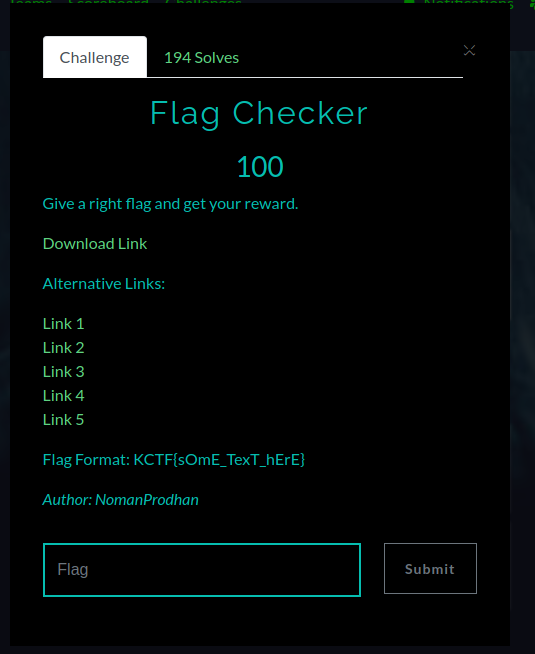
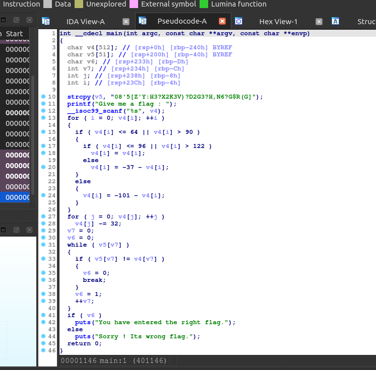
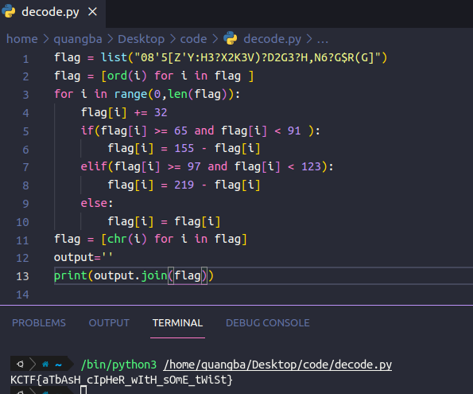

Ném file vào IDA để phân tích

Đoạn string "08'5[Z'Y:H3?X2K3V)?D2G3?H,N6?G$R(G]" được copy vào biến v5. Flag nhập vào sẽ lưu ở v4. Sau đó v4 sẽ qua
2 vòng lặp để mã hóa rồi so sánh với v5. Vậy chúng ta chỉ cần lấy v5 decode theo 2 vòng lặp kia là sẽ có flag.

*KCTF{aTbAsH_cIpHeR_wItH_sOmE_tWiSt}*
