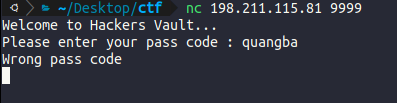
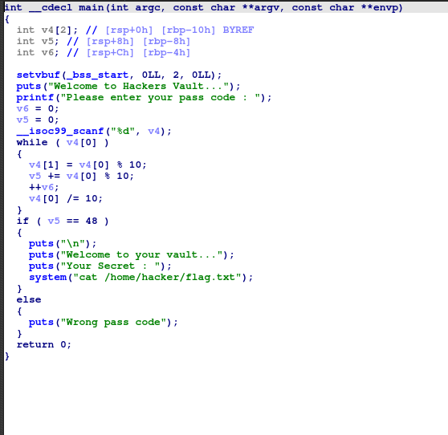
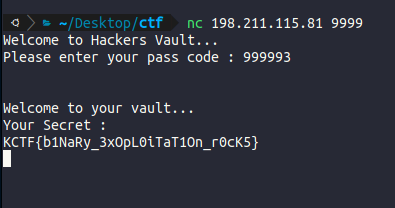

Ném file vào IDA để phân tích

<<<<<<< HEAD

=======

>>>>>>> 60baa62215ec83a7b3c46edb1d49654b560f70f2

password ta nhập vào được lưu ở biến v4. Đoạn lặp while này dùng để tính tổng các chữ số của password rồi lưu vào v5
Nếu v5 = 48 thì có flag.

KCTF{b1NaRy_3xOpL0iTaT1On_r0cK5}
<<<<<<< HEAD

=======
>>>>>>> 60baa62215ec83a7b3c46edb1d49654b560f70f2
