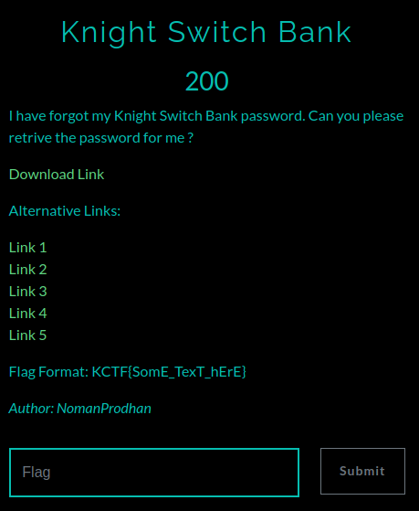
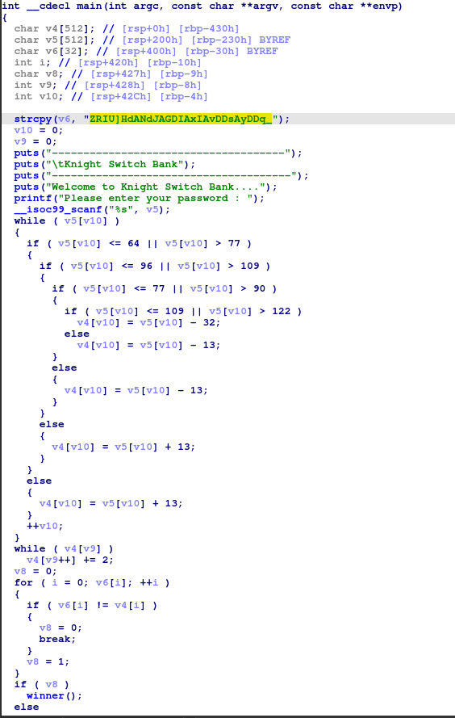
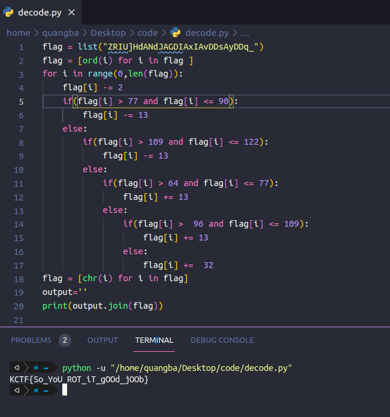

Dùng IDA pro để phân tích

Giá trị để so sánh được lưu vào biến v6, input sẽ lưu ở v5. V5 được encode rồi lưu vào v4. v4 sau đó cũng được encode bằng cách cộng mỗi kí tự vói 2.
Ta chỉ cần Decode đoạn string "ZRIU]HdANdJAGDIAxIAvDDsAyDDq_" là ra
Đây là script decode của mình 

KCTF{So_YoU_ROT_iT_gOOd_jOOb} 

