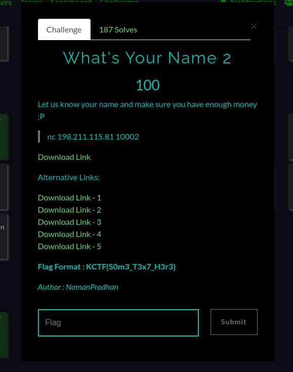
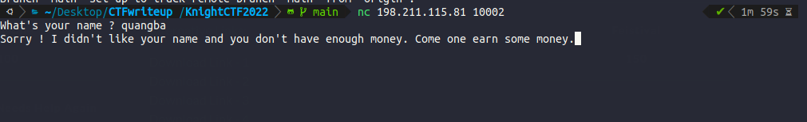
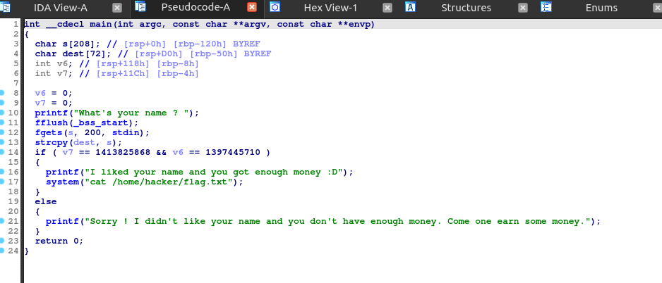
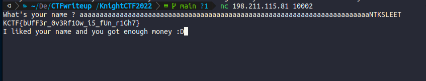

# đề bài 

Ném file vào IDA để phân tích 

ta thấy *s* nhận vào tối đa 200byte từ input. dest có độ lớn tối đa 72 byte. Hàm strcpy dẫn đến buffer overflow
Để có được flag thì ta cần giá trị của 2 biến v7 = 1413825868 và v6 = 1397445710

vậy t cần nhập đủ 72 byte + 4 byte ghi tràn sang v6 + 4byte ghi tràn sang v7

v6 = 1397445710 = 0x4e544b53 (little endian) = NTKS

v7 = 1413825868 = 0x4c454554 (little endien) = 	LEET

aaaaaaaaaaaaaaaaaaaaaaaaaaaaaaaaaaaaaaaaaaaaaaaaaaaaaaaaaaaaaaaaaaaaaaaaNTKSLEET

## KCTF{bUfF3r_0v3Rf1Ow_i5_fUn_r1Gh7}

