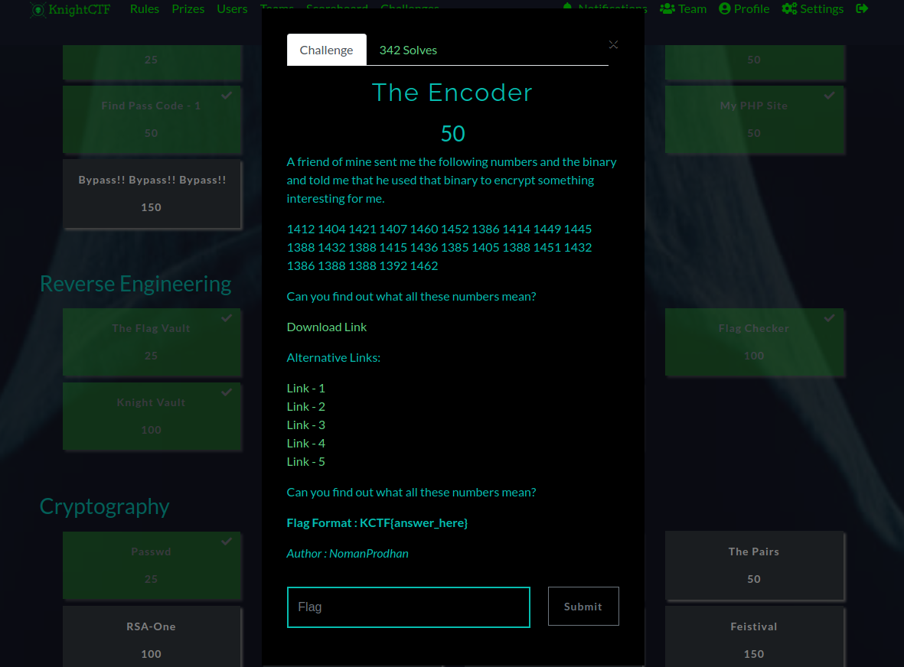
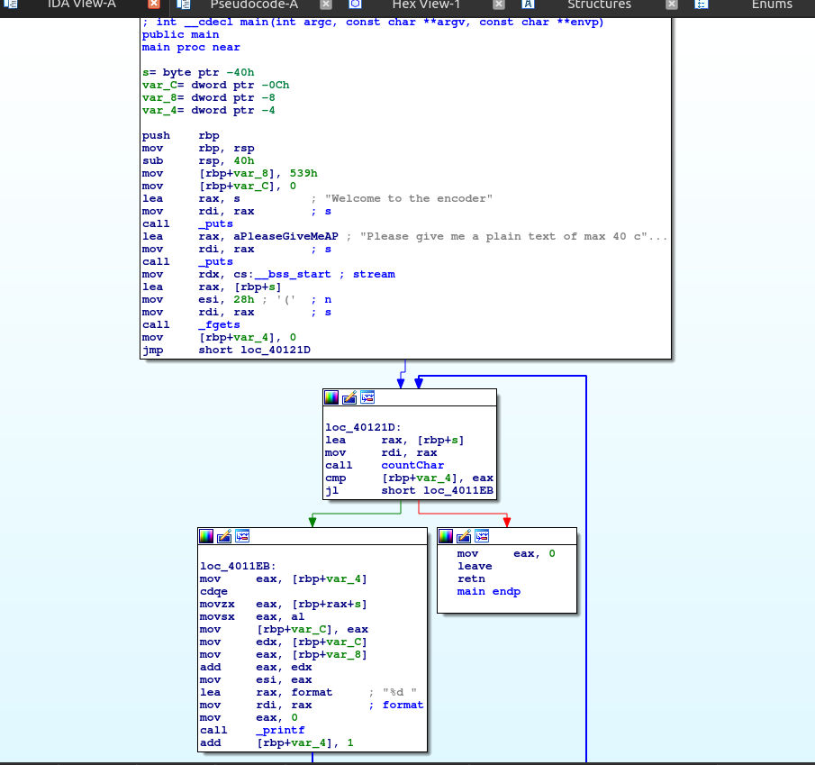
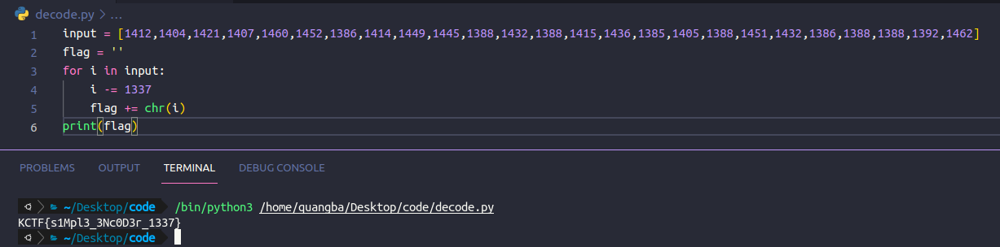

The input of program is stored in *[rbp+s]* and a loop through all character and each character will plus with *[rbp+var_8]* = 539h(1337) 
So you just need to write a simple script to loop througt all character and sub each character with 1337

KCTF{s1Mpl3_3Nc0D3r_1337}
