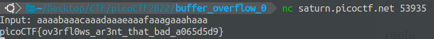

# Buffer overflow 0 100 points

## Description

Smash the stack
Let's start off simple, can you overflow the correct buffer? The program is available here. You can view source here. And connect with it using: `nc saturn.picoctf.net 53935`

## Source code

```C
#include <stdio.h>
#include <stdlib.h>
#include <string.h>
#include <signal.h>

#define FLAGSIZE_MAX 64

char flag[FLAGSIZE_MAX];

void sigsegv_handler(int sig) {
  printf("%s\n", flag);
  fflush(stdout);
  exit(1);
}

void vuln(char *input){
  char buf2[16];
  strcpy(buf2, input);
}

int main(int argc, char **argv){
  
  FILE *f = fopen("flag.txt","r");
  if (f == NULL) {
    printf("%s %s", "Please create 'flag.txt' in this directory with your",
                    "own debugging flag.\n");
    exit(0);
  }
  
  fgets(flag,FLAGSIZE_MAX,f);
  signal(SIGSEGV, sigsegv_handler); // Set up signal handler
  
  gid_t gid = getegid();
  setresgid(gid, gid, gid);


  printf("Input: ");
  fflush(stdout);
  char buf1[100];
  gets(buf1); 
  vuln(buf1);
  printf("The program will exit now\n");
  return 0;
}
```

## checksec

```terminal
    Arch:     i386-32-little
    RELRO:    Full RELRO
    Stack:    No canary found
    NX:       NX enabled
    PIE:      PIE enabled
```

## Solution

Ở đây mình thấy hàm `sigsegv_handler()` sẽ in ra flag. Hàm này sẽ chạy khi xảy ra lỗi segmentation fault. Vì vậy chỉ cần làm chương trình crash thì sẽ lấy được flag.

