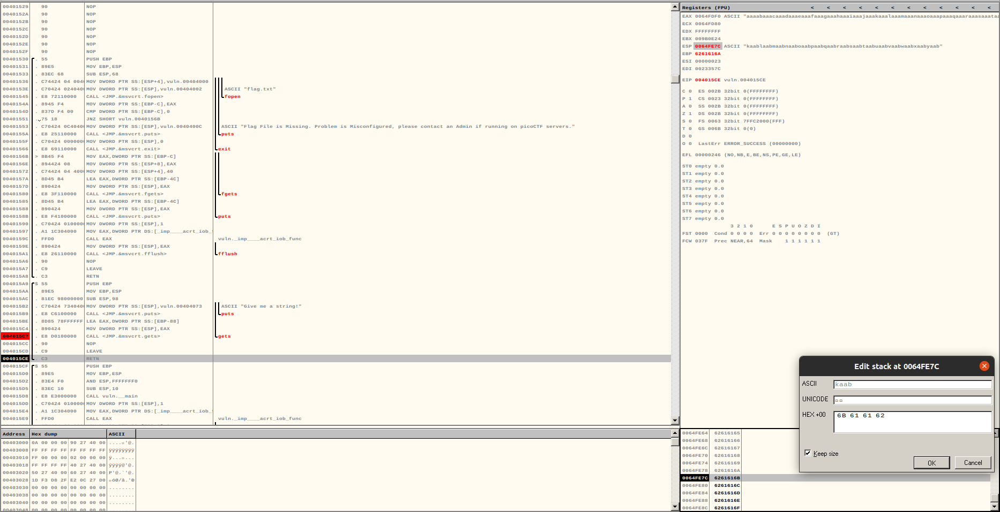
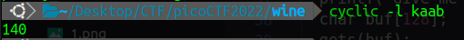
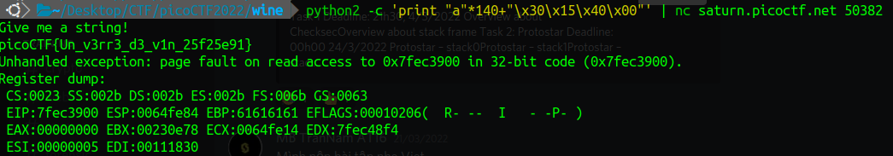

# wine

## Description

Challenge best paired with wine.
I love windows. Checkout my exe running on a linux box

## source code 

```C
#include <stdio.h>
#include <stdlib.h>
#include <string.h>
#include <unistd.h>
#include <sys/types.h>
#include <wchar.h>
#include <locale.h>

#define BUFSIZE 64
#define FLAGSIZE 64

void win(){
  char buf[FLAGSIZE];
  FILE *f = fopen("flag.txt","r");
  if (f == NULL) {
    printf("Flag File is Missing. Problem is Misconfigured, please contact an Admin if running on picoCTF servers.\n");
    exit(0);
  }

  fgets(buf,FLAGSIZE,f); // size bound read
  puts(buf);
  fflush(stdout);
}

void vuln()
{
  printf("Give me a string!\n");
  char buf[128];
  gets(buf);
}
 
int main(int argc, char **argv)
{

  setvbuf(stdout, NULL, _IONBF, 0);
  vuln();
  return 0;
}
```

## solution

return về hàm `win()` để nhận flag



Trước khi lệnh `RETN` được thực hiện, `esp` đang trỏ đến `0064FE7C   6261616B`



