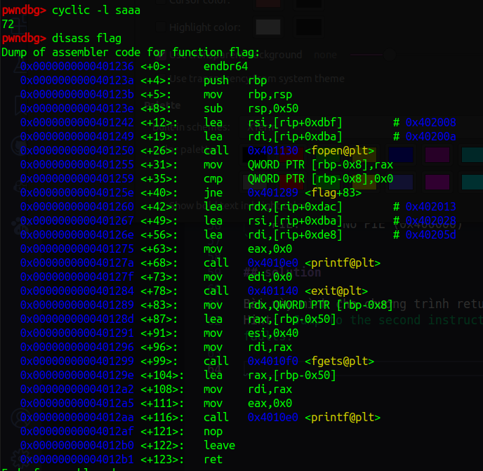
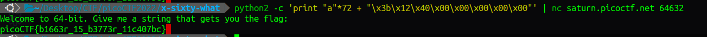

# x-sixty-what  200points

## Description

Overflow x64 code
Most problems before this are 32-bit x86. Now we'll consider 64-bit x86 which is a little different! Overflow the buffer and change the return address to the flag function in this program

## source code

```C
#include <stdio.h>
#include <stdlib.h>
#include <string.h>
#include <unistd.h>
#include <sys/types.h>

#define BUFFSIZE 64
#define FLAGSIZE 64

void flag() {
  char buf[FLAGSIZE];
  FILE *f = fopen("flag.txt","r");
  if (f == NULL) {
    printf("%s %s", "Please create 'flag.txt' in this directory with your",
                    "own debugging flag.\n");
    exit(0);
  }

  fgets(buf,FLAGSIZE,f);
  printf(buf);
}

void vuln(){
  char buf[BUFFSIZE];
  gets(buf);
}

int main(int argc, char **argv){

  setvbuf(stdout, NULL, _IONBF, 0);
  gid_t gid = getegid();
  setresgid(gid, gid, gid);
  puts("Welcome to 64-bit. Give me a string that gets you the flag: ");
  vuln();
  return 0;
}
```

## checksec

```terminal
    Arch:     amd64-64-little
    RELRO:    Partial RELRO
    Stack:    No canary found
    NX:       NX enabled
    PIE:      No PIE (0x400000)
```

## solution

Bài này mình cho chương trình return về hàm flag() nhưng bị lỗi segmentation fault. Sau đó thì mình có xem hint và mình đã lấy được flag
Hint: `Jump to the second instruction (the one after the first push) in the flag function, if you're getting mysterious segmentation faults.`



